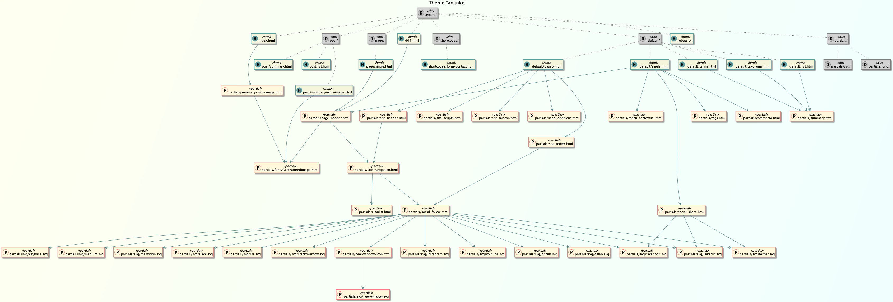
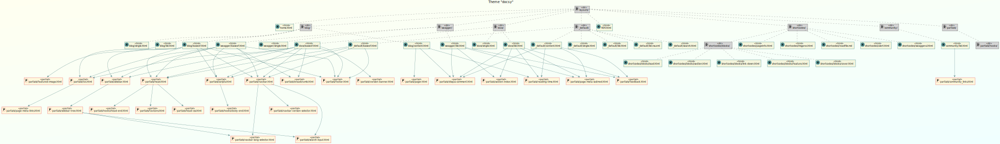

# Hugo Layout Visualiser

Creates a `.wsd` file containing PlantUML markup from a Hugo theme.  

The markup can then be turned into an image using Visual Studio Code, PyCharm previewers, 
or on the web via services like:

- http://www.plantuml.com/plantuml/uml/ 
- https://plantuml-editor.kkeisuke.com/ 
- https://gituml.com

## Installation

```shell script
pipenv install
```

If you don't have `pipenv` its easy to install 
e.g. on Mac use [brew](https://brew.sh/) to:

```shell script
brew install pipx
pipx install pipenv
```

## Usage

Just run
```shell script
python visualiser.py
```

the `.wsd` file with the same name as your theme will be created
in the `out/` directory. 
Please manually create the out directory first. 

Edit the bottom of `visualiser.py` to
specify the theme name and path (CLI enhancement is needed, yes).
E.g.

```python
scan("example_theme", "/Users/Andy/Devel/hugo_tests/hugo-layout-visualiser/")
```

## Example Output

Here is the famous [ananke](https://themes.gohugo.io/gohugo-theme-ananke/) theme.


Here is the [docsy](https://themes.gohugo.io/docsy/) theme, with 
a few modifications


## Future enhancements

- auto create `out/` directory
- turn this tool into a CLI based script, where you can specify 
themes and paths and output locations on the command line.
- call the internet to render the PlantUML automatically into
an image and create the image file directly on the user's 
computer.
